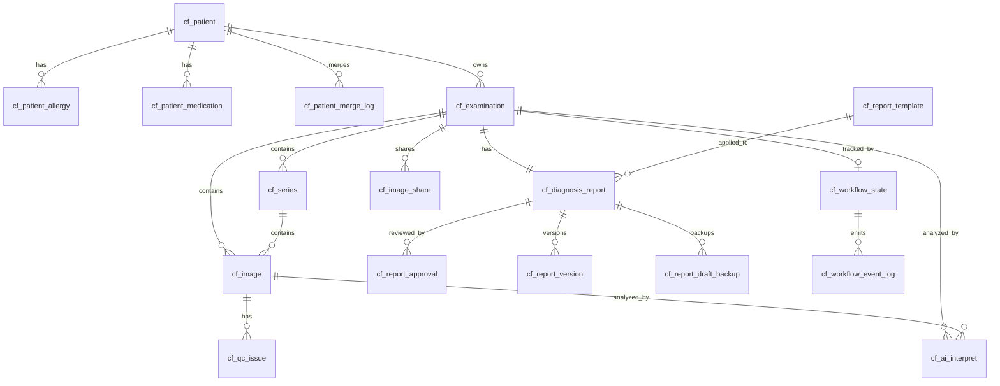

# 数据库设计规范与建模说明

## 1. 文档目的

本文档用于统一云胶片系统的数据库建模方式，作为后续数据库设计、代码实现、Flyway 迁移、评审和演进的共同依据。

本文档重点解决以下问题：

- 统一业务模型、逻辑模型、物理模型三层设计方法
- 统一 `init_db.sql` 与 Flyway migrations 的角色
- 统一 Bounded Context 边界
- 统一 ID 策略、状态机策略、审计与逻辑删除策略
- 统一 JSON 与拆表边界
- 指导后续数据库设计与代码映射保持一致

---

## 2. 适用范围

本文档适用于以下范围：

- `src/database/init_db.sql`
- `src/database/migrations/*.sql`
- `medical-system` 模块中的业务实体、Mapper、Service
- 后续新增的 `cf_*` 业务表
- 与医疗影像、患者、报告、分享、AI、工作流、审计相关的数据建模

不适用于：

- 第三方系统数据库
- 独立 BI 数仓模型
- 临时测试表、导入中间表、一次性脚本

---

## 3. 总体设计目标

数据库模型设计应满足以下目标：

1. **支持核心医疗影像业务闭环**
   - 患者
   - 检查
   - 影像
   - 报告
   - 分享
   - AI 辅助
   - 审计追踪

2. **支持按 Bounded Context 演进**
   - 避免所有业务逻辑都堆积到少数大表中
   - 允许上下文独立扩展与迁移

3. **支持 SQL Server 2019 + Flyway 的持续演进**
   - 结构可增量迁移
   - 可版本管理
   - 可验证

4. **支持与 Java 业务代码稳定映射**
   - 与 MyBatis Plus、实体类、Mapper 设计保持一致
   - 降低数据库与代码模型割裂风险

---

## 4. 建模分层规范

数据库建模必须按以下三层进行，不允许直接跳过前两层只做物理表设计。

### 4.1 业务模型设计

业务模型设计回答的问题是：

- 系统有哪些核心业务对象
- 这些对象属于哪个业务上下文
- 业务流程如何流转
- 哪些对象是聚合根
- 哪些规则要求强一致

业务模型不关注字段类型和索引。

### 4.2 逻辑模型设计

逻辑模型设计回答的问题是：

- 业务对象如何映射成实体
- 实体之间是什么关系
- 哪些是一对一、一对多、多对多
- 哪些字段必须唯一
- 哪些状态需要建模
- 哪些数据应拆表，哪些可以用 JSON

逻辑模型不直接绑定数据库方言细节。

### 4.3 物理模型设计

物理模型设计回答的问题是：

- 在 SQL Server 2019 上如何建表
- 主键、外键、索引、约束如何落地
- 字段类型如何定义
- 如何使用 Flyway 管理演进

---

## 5. 数据库真相源规范

### 5.1 真相源定义

数据库结构的唯一演进真相源应为：

- `src/database/migrations/*.sql`

Flyway migrations 是后续数据库结构演进的唯一标准入口。

### 5.2 init_db.sql 的定位

`src/database/init_db.sql` 不应继续作为数据库设计真相源。

其后续定位只能是以下之一：

1. 开发环境快照脚本
2. 历史兼容初始化脚本
3. 基于 migration 生成的临时启动脚本

禁止出现以下情况：

- 同时维护两套结构并长期不一致
- 新增字段只改 `init_db.sql` 不改 migration
- 修改 migration 后不更新初始化逻辑

---

## 6. Bounded Context 设计规范

系统数据库按业务上下文划分，推荐采用以下基线。

### 6.1 患者信息 BC

职责：

- 患者主数据
- 过敏信息
- 用药信息
- 患者合并与去重追踪

核心对象：

- Patient
- PatientAllergy
- PatientMedication
- PatientMergeLog

### 6.2 影像管理 BC

职责：

- 检查单
- DICOM Study / Series / Image
- 影像质量控制
- 影像存储引用

核心对象：

- Examination
- Series
- Image
- QCIssue

### 6.3 诊断报告 BC

职责：

- 报告主内容
- 报告模板
- 审核流转
- 报告版本
- 草稿备份

核心对象：

- DiagnosticReport
- ReportTemplate
- ReportApproval
- ReportVersion
- ReportDraftBackup

### 6.4 分享管理 BC

职责：

- 影像/报告对外分享
- 提取码与访问控制
- 分享范围控制
- 过期控制与访问追踪

核心对象：

- ImageShare

说明：该上下文在产品功能中存在，在旧 schema 中存在，应作为正式上下文补齐。

### 6.5 AI / 临床决策 BC

职责：

- AI 分析结果
- 模型输出
- 置信度
- 医生反馈
- 融合结果

核心对象：

- AIInterpretation

### 6.6 存储管理 BC

职责：

- 冷热分层迁移
- 存储统计
- 存储层级管理

核心对象：

- StorageMigration
- StorageStatistics

### 6.7 安全审计 BC

职责：

- 用户访问审计
- 风险规则
- 下载与敏感操作留痕

核心对象：

- AuditLog
- SecurityRule

### 6.8 工作流编排 BC

职责：

- 流程状态快照
- 事件流记录
- SLA 跟踪

核心对象：

- WorkflowState
- WorkflowEventLog

约束：工作流上下文不能替代业务主状态定义。

---

## 7. 聚合与引用规范

### 7.1 聚合根定义原则

每个上下文必须明确聚合根，聚合根负责：

- 生命周期管理
- 核心状态管理
- 一致性边界控制

推荐聚合根：

- Patient
- Examination
- DiagnosticReport
- ImageShare
- AIInterpretation
- WorkflowState

### 7.2 跨聚合引用规则

跨聚合、跨上下文之间只能通过 ID 引用，不允许通过内嵌对象关系形成隐式强耦合。

例如允许：

- Report 引用 `exam_id`
- AIInterpretation 引用 `image_id`
- ImageShare 引用 `exam_id`

不建议：

- 直接让报告表持有序列级业务状态
- 让审计表强依赖业务表生命周期

---

## 8. 业务主线规范

数据库建模必须围绕以下业务主线展开：

**Patient → Examination → Series → Image → QC → AI → Report → Share → Audit**

所有新业务设计优先评估其在主线中的位置，再决定所属上下文和表结构归属。

---

## 9. ID 设计规范

### 9.1 主键策略

所有业务主表推荐统一采用：

- `id BIGINT`

作为数据库物理主键。

### 9.2 业务编号策略

对外可读编号、业务编码、自然键应独立于主键存在，不应替代主键。

示例：

- `patient_no`
- `exam_no`
- `share_no`
- `study_instance_uid`
- `series_instance_uid`
- `sop_instance_uid`

### 9.3 不推荐的做法

不推荐继续将带前缀字符串业务编号直接作为数据库主键长期使用，例如：

- `Pxxxx`
- `Exxxx`
- `Ixxxx`
- `Rxxxx`

这些编号可以保留为业务编号，但不应作为主键标准方案。

---

## 10. 状态机设计规范

### 10.1 基本原则

状态字段不是附属字段，而是核心业务字段。
所有核心业务表都必须先定义状态机，再设计表结构。

### 10.2 状态所有权原则

每类主状态必须有唯一拥有者：

- 检查业务主状态：`cf_examination.exam_status`
- 报告主状态：`cf_diagnosis_report.status`
- QC 状态：`cf_image.qc_status`
- AI 状态：相关 AI 主表字段
- 分享状态：`cf_image_share.status`
- 工作流状态：`cf_workflow_state.current_state`

### 10.3 禁止规则

禁止多个表同时定义同一业务对象的主状态真相源。

例如：

- `workflow_state` 不应替代 `exam_status`
- `audit_log` 不应承担业务状态主存储职责

### 10.4 状态约束

稳定的枚举状态必须下沉到数据库层，通过 `CHECK` 约束控制。

---

## 11. 逻辑删除与数据保留规范

### 11.1 主业务表

主业务表默认采用逻辑删除：

- `del_flag`
- 必要时后续扩展：
  - `deleted_at`
  - `deleted_by`

适用对象：

- Patient
- Examination
- Image
- DiagnosticReport
- Share
- AI 主表等

### 11.2 历史/版本类表

历史表、版本表原则上不进行逻辑删除，默认保留。

适用对象：

- ReportVersion
- ReportApproval
- DraftBackup
- MergeLog

### 11.3 审计/事件类表

审计日志、事件日志必须视为 append-only 数据，不允许逻辑删除，不允许因主业务删除而丢失历史。

适用对象：

- AuditLog
- WorkflowEventLog

---

## 12. JSON 与拆表规范

### 12.1 适合 JSON 的场景

以下内容可以使用 JSON 存储：

- 高变化结构
- 整体读取为主
- 不作为主查询条件
- 不具备独立生命周期
- 不需要复杂权限控制

典型场景：

- AI 模型原始输出
- 融合结果
- 审计明细
- 风险规则命中详情
- 工作流上下文快照

### 12.2 必须拆表的场景

以下内容应优先拆表：

- 高频查询/筛选/统计字段
- 具备独立生命周期的数据
- 需要单条维护的数据
- 需要权限控制或状态流转的数据

典型场景：

- 过敏信息
- 用药信息
- Series
- QCIssue
- ReportVersion
- 审核记录

### 12.3 禁止规则

禁止将核心主外键关系、状态字段、业务唯一键长期存于 JSON 中。

---

## 13. 表命名规范

### 13.1 前缀规范

- 系统域表：`sys_*`
- 业务域表：`cf_*`

### 13.2 命名风格

表名统一使用：

- 小写
- 下划线风格
- 语义明确的英文名

示例：

- `cf_patient`
- `cf_examination`
- `cf_series`
- `cf_image`
- `cf_diagnosis_report`

---

## 14. 字段命名规范

### 14.1 通用字段命名

核心业务表推荐统一包含：

- `id`
- `version`
- `created_at`
- `updated_at`
- `created_by`
- `updated_by`
- `del_flag`

### 14.2 外键字段命名

外键命名统一使用引用对象名称 + `_id`

示例：

- `patient_id`
- `exam_id`
- `series_id`
- `image_id`
- `report_id`
- `template_id`

### 14.3 时间字段命名

统一使用：

- `created_at`
- `updated_at`
- `published_at`
- `reviewed_at`
- `archived_at`
- `expired_at`

不建议继续混用：

- `create_time`
- `update_time`

---

## 15. 字段类型规范

### 15.1 主键类型

- `BIGINT`

### 15.2 时间类型

推荐使用：

- `DATETIME2`

日期和时间有明确拆分场景时可使用：

- `DATE`
- `TIME`

### 15.3 字符类型

- 中文/通用文本：`NVARCHAR`
- 长文本：`NVARCHAR(MAX)`
- 路径、编码类可按需要使用 `VARCHAR`

### 15.4 废弃方向

不建议继续使用：

- `TEXT`

---

## 16. 索引设计规范

### 16.1 必建索引

以下类型必须优先考虑：

1. 主键索引
2. 自然唯一键索引
3. 外键索引
4. 状态索引
5. 时间索引
6. 活跃数据过滤索引（`del_flag = '0'`）

### 16.2 常见唯一键

典型唯一键包括：

- `patient_no`
- `study_instance_uid`
- `series_instance_uid`
- `sop_instance_uid`
- `share_no`
- `audit_id`
- `workflow_id`

### 16.3 索引设计原则

索引必须围绕真实查询路径设计，而不是只围绕主外键设计。

重点关注：

- 患者历史检查列表
- 检查下影像列表
- 报告待审核列表
- 分享有效链接列表
- 审计时间区间查询

---

## 17. 约束设计规范

### 17.1 Check 约束

稳定枚举值必须使用 `CHECK` 约束。

适用字段：

- 性别
- 检查状态
- 报告状态
- QC 状态
- AI 状态
- 风险级别
- 存储层级
- 分享状态

### 17.2 外键约束

核心业务表之间应优先使用显式 FK。

适用：

- Examination → Patient
- Series → Examination
- Image → Examination / Series / Patient
- Report → Examination / Patient / Template

### 17.3 审计表特殊规则

审计表、日志表可不强制对业务表建立 FK，以避免：

- 业务删除影响历史留存
- 归档/迁移影响审计完整性

---

## 18. 核心 BC 逻辑模型规范

### 18.1 患者信息 BC

推荐实体：

- Patient
- PatientAllergy
- PatientMedication
- PatientMergeLog

关系：

- Patient 1:N Allergy
- Patient 1:N Medication
- Patient 1:N MergeLog

规则：

- 患者主数据必须唯一识别
- 过敏、用药应拆表
- 合并操作必须保留追溯链路

### 18.2 影像管理 BC

推荐实体：

- Examination
- Series
- Image
- QCIssue

关系：

- Patient 1:N Examination
- Examination 1:N Series
- Series 1:N Image
- Image 1:N QCIssue

规则：

- Study / Series / SOP UID 分层建模必须保留
- 不允许回退为单表扁平影像模型
- QC 汇总态与明细分开建模

### 18.3 诊断报告 BC

推荐实体：

- ReportTemplate
- DiagnosticReport
- ReportApproval
- ReportVersion
- ReportDraftBackup

关系：

- Examination 1:1 DiagnosticReport
- DiagnosticReport 1:N ReportApproval
- DiagnosticReport 1:N ReportVersion
- DiagnosticReport 1:N ReportDraftBackup

规则：

- 正式报告与版本历史分离
- 审核记录不可覆盖
- 草稿备份不等于正式版本

### 18.4 分享管理 BC

推荐实体：

- ImageShare

建议字段方向：

- `share_scope`
- `access_mode`
- `status`
- `expire_at`
- `max_access_count`
- `access_count`
- `last_accessed_at`

规则：

- 分享必须可失效
- 分享必须具备访问控制能力
- 分享对象应明确作用于 Examination 或其聚合产物

---

## 19. ER 关系说明

### 19.1 主链路

```text
cf_patient
  ├── cf_patient_allergy
  ├── cf_patient_medication
  ├── cf_patient_merge_log
  └── cf_examination
        ├── cf_series
        │     └── cf_image
        │           ├── cf_qc_issue
        │           ├── cf_ai_interpret
        │           └── cf_audit_log
        ├── cf_diagnosis_report
        │     ├── cf_report_approval
        │     ├── cf_report_version
        │     └── cf_report_draft_backup
        ├── cf_image_share
        ├── cf_workflow_state
        │     └── cf_workflow_event_log
        ├── cf_ai_interpret
        └── cf_audit_log
```

### 19.2 横切关系

```text
cf_audit_log
  ├── patient_id   -> cf_patient
  ├── exam_id      -> cf_examination
  ├── image_id     -> cf_image
  ├── report_id    -> cf_diagnosis_report
  ├── share_id     -> cf_image_share
  └── ai_id        -> cf_ai_interpret
```

说明：
- 审计关系更适合作为逻辑引用
- 不建议全部做强 FK

### 19.3 Mermaid ER 草图



---

## 20. 字段级模板附录

### 20.1 `cf_patient`

| 字段名 | 类型 | 必填 | 默认值 | 约束/索引 | 说明 |
|---|---|---:|---|---|---|
| id | BIGINT | 是 | - | PK | 物理主键 |
| patient_no | VARCHAR(32) | 是 | - | UK | 患者业务编号 |
| name | NVARCHAR(100) | 是 | - | IDX | 患者姓名 |
| gender | CHAR(1) | 是 | `'U'` | CHECK | `M/F/U` |
| birth_date | DATE | 否 | - |  | 出生日期 |
| id_card | VARCHAR(32) | 否 | - | IDX | 身份证号 |
| phone | VARCHAR(20) | 否 | - | IDX | 联系电话 |
| address | NVARCHAR(255) | 否 | - |  | 地址 |
| blood_type | VARCHAR(8) | 否 | - |  | 血型 |
| marital_status | VARCHAR(20) | 否 | - |  | 婚姻状态 |
| emergency_contact | NVARCHAR(100) | 否 | - |  | 紧急联系人 |
| emergency_phone | VARCHAR(20) | 否 | - |  | 紧急联系电话 |
| family_history | NVARCHAR(MAX) | 否 | - |  | 家族史 |
| medical_history_summary | NVARCHAR(MAX) | 否 | - |  | 病史摘要 |
| status | VARCHAR(20) | 是 | `'active'` | CHECK, IDX | 状态 |
| version | INT | 是 | `1` |  | 版本 |
| created_at | DATETIME2 | 是 | `SYSDATETIME()` | IDX | 创建时间 |
| updated_at | DATETIME2 | 是 | `SYSDATETIME()` |  | 更新时间 |
| created_by | BIGINT | 否 | - |  | 创建人 |
| updated_by | BIGINT | 否 | - |  | 更新人 |
| del_flag | CHAR(1) | 是 | `'0'` | CHECK, IDX | 逻辑删除 |

### 20.2 `cf_examination`

| 字段名 | 类型 | 必填 | 默认值 | 约束/索引 | 说明 |
|---|---|---:|---|---|---|
| id | BIGINT | 是 | - | PK | 主键 |
| exam_no | VARCHAR(32) | 是 | - | UK | 检查业务编号 |
| patient_id | BIGINT | 是 | - | FK, IDX | 患者ID |
| study_instance_uid | VARCHAR(128) | 否 | - | UK | Study UID |
| accession_no | VARCHAR(64) | 否 | - | IDX | 申请单号 |
| exam_type | NVARCHAR(50) | 否 | - |  | 检查类型 |
| modality | VARCHAR(20) | 否 | - | IDX | 模态 |
| body_part | NVARCHAR(50) | 否 | - |  | 部位 |
| exam_dept | NVARCHAR(100) | 否 | - |  | 科室 |
| request_doctor | NVARCHAR(100) | 否 | - |  | 申请医生 |
| performing_doctor | NVARCHAR(100) | 否 | - |  | 执行医生 |
| study_date | DATE | 否 | - | IDX | 检查日期 |
| study_time | TIME | 否 | - |  | 检查时间 |
| clinical_diagnosis | NVARCHAR(500) | 否 | - |  | 临床诊断 |
| exam_description | NVARCHAR(500) | 否 | - |  | 检查说明 |
| exam_status | VARCHAR(50) | 是 | `'pending'` | CHECK, IDX | 检查状态 |
| ai_status | VARCHAR(30) | 是 | `'pending'` | CHECK | AI状态 |
| priority | VARCHAR(20) | 否 | `'normal'` | CHECK | 优先级 |
| qc_overall_status | VARCHAR(30) | 否 | `'pending'` | CHECK | QC汇总态 |
| scheduled_at | DATETIME2 | 否 | - |  | 预约时间 |
| started_at | DATETIME2 | 否 | - |  | 开始时间 |
| completed_at | DATETIME2 | 否 | - |  | 完成时间 |
| report_due_at | DATETIME2 | 否 | - | IDX | 报告截止 |
| reported_at | DATETIME2 | 否 | - |  | 报告出具时间 |
| version | INT | 是 | `1` |  | 版本 |
| created_at | DATETIME2 | 是 | `SYSDATETIME()` | IDX | 创建时间 |
| updated_at | DATETIME2 | 是 | `SYSDATETIME()` |  | 更新时间 |
| created_by | BIGINT | 否 | - |  | 创建人 |
| updated_by | BIGINT | 否 | - |  | 更新人 |
| del_flag | CHAR(1) | 是 | `'0'` | CHECK, IDX | 逻辑删除 |

### 20.3 `cf_series`

| 字段名 | 类型 | 必填 | 默认值 | 约束/索引 | 说明 |
|---|---|---:|---|---|---|
| id | BIGINT | 是 | - | PK | 主键 |
| exam_id | BIGINT | 是 | - | FK, IDX | 检查ID |
| patient_id | BIGINT | 否 | - | IDX | 冗余患者ID |
| series_instance_uid | VARCHAR(128) | 是 | - | UK | Series UID |
| series_number | INT | 否 | `0` | IDX | 序列号 |
| modality | VARCHAR(20) | 否 | - |  | 模态 |
| body_part | NVARCHAR(50) | 否 | - |  | 部位 |
| series_description | NVARCHAR(255) | 否 | - |  | 描述 |
| image_count | INT | 是 | `0` |  | 图像数量 |
| storage_tier | VARCHAR(20) | 是 | `'hot'` | CHECK | 存储层级 |
| created_at | DATETIME2 | 是 | `SYSDATETIME()` |  | 创建时间 |
| updated_at | DATETIME2 | 是 | `SYSDATETIME()` |  | 更新时间 |
| del_flag | CHAR(1) | 是 | `'0'` | CHECK | 逻辑删除 |

### 20.4 `cf_image`

| 字段名 | 类型 | 必填 | 默认值 | 约束/索引 | 说明 |
|---|---|---:|---|---|---|
| id | BIGINT | 是 | - | PK | 主键 |
| exam_id | BIGINT | 是 | - | FK, IDX | 检查ID |
| series_id | BIGINT | 是 | - | FK, IDX | 序列ID |
| patient_id | BIGINT | 否 | - | IDX | 冗余患者ID |
| sop_instance_uid | VARCHAR(128) | 是 | - | UK | SOP UID |
| instance_number | INT | 否 | `0` | IDX | 图像序号 |
| modality | VARCHAR(20) | 否 | - |  | 模态 |
| image_type | NVARCHAR(100) | 否 | - |  | 类型 |
| acquisition_time | DATETIME2 | 否 | - |  | 采集时间 |
| slice_location | DECIMAL(10,2) | 否 | - |  | 层面位置 |
| file_path | NVARCHAR(500) | 是 | - |  | 文件路径 |
| thumbnail_path | NVARCHAR(500) | 否 | - |  | 缩略图路径 |
| file_size | BIGINT | 否 | `0` |  | 文件大小 |
| file_format | VARCHAR(20) | 否 | `'dicom'` |  | 文件格式 |
| storage_tier | VARCHAR(20) | 是 | `'hot'` | CHECK, IDX | 存储层级 |
| qc_status | VARCHAR(30) | 是 | `'pending'` | CHECK, IDX | QC状态 |
| qc_score | DECIMAL(5,2) | 否 | - |  | QC分数 |
| is_key_image | CHAR(1) | 是 | `'0'` | CHECK | 是否关键图 |
| version | INT | 是 | `1` |  | 版本 |
| created_at | DATETIME2 | 是 | `SYSDATETIME()` |  | 创建时间 |
| updated_at | DATETIME2 | 是 | `SYSDATETIME()` |  | 更新时间 |
| created_by | BIGINT | 否 | - |  | 创建人 |
| updated_by | BIGINT | 否 | - |  | 更新人 |
| del_flag | CHAR(1) | 是 | `'0'` | CHECK | 逻辑删除 |

### 20.5 `cf_diagnosis_report`

| 字段名 | 类型 | 必填 | 默认值 | 约束/索引 | 说明 |
|---|---|---:|---|---|---|
| id | BIGINT | 是 | - | PK | 主键 |
| exam_id | BIGINT | 是 | - | FK, UK | 检查ID |
| patient_id | BIGINT | 是 | - | FK, IDX | 患者ID |
| template_id | BIGINT | 否 | - | FK | 模板ID |
| title | NVARCHAR(200) | 否 | - |  | 标题 |
| findings | NVARCHAR(MAX) | 否 | - |  | 所见 |
| impression | NVARCHAR(MAX) | 否 | - |  | 结论 |
| recommendation | NVARCHAR(MAX) | 否 | - |  | 建议 |
| icd_codes | NVARCHAR(MAX) | 否 | - |  | ICD编码 |
| report_summary | NVARCHAR(500) | 否 | - |  | 摘要 |
| author_id | BIGINT | 否 | - | IDX | 报告医生 |
| review_doctor_id | BIGINT | 否 | - | IDX | 审核医生 |
| publish_doctor_id | BIGINT | 否 | - |  | 发布医生 |
| status | VARCHAR(30) | 是 | `'draft'` | CHECK, IDX | 状态 |
| current_version_no | INT | 是 | `1` |  | 当前版本号 |
| pdf_path | NVARCHAR(500) | 否 | - |  | PDF路径 |
| drafted_at | DATETIME2 | 否 | - |  | 草拟时间 |
| submitted_at | DATETIME2 | 否 | - | IDX | 提交时间 |
| approved_at | DATETIME2 | 否 | - |  | 审核通过时间 |
| published_at | DATETIME2 | 否 | - | IDX | 发布时间 |
| archived_at | DATETIME2 | 否 | - |  | 归档时间 |
| version | INT | 是 | `1` |  | 乐观锁 |
| created_at | DATETIME2 | 是 | `SYSDATETIME()` |  | 创建时间 |
| updated_at | DATETIME2 | 是 | `SYSDATETIME()` |  | 更新时间 |
| created_by | BIGINT | 否 | - |  | 创建人 |
| updated_by | BIGINT | 否 | - |  | 更新人 |
| del_flag | CHAR(1) | 是 | `'0'` | CHECK | 逻辑删除 |

### 20.6 `cf_image_share`

| 字段名 | 类型 | 必填 | 默认值 | 约束/索引 | 说明 |
|---|---|---:|---|---|---|
| id | BIGINT | 是 | - | PK | 主键 |
| share_no | VARCHAR(32) | 是 | - | UK | 分享编号 |
| exam_id | BIGINT | 是 | - | FK, IDX | 检查ID |
| patient_id | BIGINT | 否 | - | IDX | 患者ID |
| report_id | BIGINT | 否 | - | FK | 报告ID |
| share_scope | VARCHAR(30) | 是 | `'full_package'` | CHECK | 分享范围 |
| access_mode | VARCHAR(30) | 是 | `'code'` | CHECK | 访问方式 |
| extract_code | VARCHAR(20) | 否 | - |  | 提取码 |
| status | VARCHAR(20) | 是 | `'active'` | CHECK, IDX | 分享状态 |
| expire_at | DATETIME2 | 否 | - | IDX | 过期时间 |
| max_access_count | INT | 否 | - |  | 最大访问次数 |
| access_count | INT | 是 | `0` |  | 当前访问次数 |
| last_accessed_at | DATETIME2 | 否 | - |  | 最近访问时间 |
| allow_download | CHAR(1) | 是 | `'0'` | CHECK | 是否允许下载 |
| desensitization_policy | NVARCHAR(MAX) | 否 | - |  | 脱敏策略 |
| created_by | BIGINT | 否 | - |  | 创建人 |
| created_at | DATETIME2 | 是 | `SYSDATETIME()` |  | 创建时间 |
| updated_at | DATETIME2 | 是 | `SYSDATETIME()` |  | 更新时间 |
| del_flag | CHAR(1) | 是 | `'0'` | CHECK | 逻辑删除 |

### 20.7 `cf_ai_interpret`

| 字段名 | 类型 | 必填 | 默认值 | 约束/索引 | 说明 |
|---|---|---:|---|---|---|
| id | BIGINT | 是 | - | PK | 主键 |
| exam_id | BIGINT | 否 | - | FK, IDX | 检查ID |
| image_id | BIGINT | 否 | - | FK, IDX | 影像ID |
| patient_id | BIGINT | 否 | - | IDX | 患者ID |
| model_name | NVARCHAR(100) | 是 | - | IDX | 模型名称 |
| model_version | VARCHAR(50) | 否 | - |  | 模型版本 |
| analysis_type | VARCHAR(50) | 否 | - |  | 分析类型 |
| status | VARCHAR(20) | 是 | `'pending'` | CHECK, IDX | 分析状态 |
| confidence_score | DECIMAL(5,2) | 否 | - |  | 置信度 |
| model_results | NVARCHAR(MAX) | 否 | - |  | 模型输出JSON |
| ensemble_result | NVARCHAR(MAX) | 否 | - |  | 融合结果JSON |
| doctor_feedback | NVARCHAR(MAX) | 否 | - |  | 医生反馈JSON |
| ground_truth | NVARCHAR(MAX) | 否 | - |  | 标注真值JSON |
| analysis_started_at | DATETIME2 | 否 | - |  | 开始时间 |
| analysis_completed_at | DATETIME2 | 否 | - | IDX | 完成时间 |
| version | INT | 是 | `1` |  | 版本 |
| created_at | DATETIME2 | 是 | `SYSDATETIME()` |  | 创建时间 |
| updated_at | DATETIME2 | 是 | `SYSDATETIME()` |  | 更新时间 |
| created_by | BIGINT | 否 | - |  | 创建人 |
| updated_by | BIGINT | 否 | - |  | 更新人 |
| del_flag | CHAR(1) | 是 | `'0'` | CHECK | 逻辑删除 |

### 20.8 `cf_audit_log`

| 字段名 | 类型 | 必填 | 默认值 | 约束/索引 | 说明 |
|---|---|---:|---|---|---|
| id | BIGINT | 是 | - | PK | 主键 |
| audit_id | VARCHAR(64) | 是 | - | UK | 审计编号 |
| user_id | BIGINT | 否 | - | IDX | 用户ID |
| user_name | NVARCHAR(100) | 否 | - |  | 用户名 |
| action_type | VARCHAR(50) | 是 | - | IDX | 动作类型 |
| resource_type | VARCHAR(50) | 否 | - | IDX | 资源类型 |
| resource_id | BIGINT | 否 | - |  | 资源ID |
| patient_id | BIGINT | 否 | - | IDX | 患者ID |
| exam_id | BIGINT | 否 | - | IDX | 检查ID |
| image_id | BIGINT | 否 | - | IDX | 影像ID |
| report_id | BIGINT | 否 | - | IDX | 报告ID |
| share_id | BIGINT | 否 | - | IDX | 分享ID |
| ai_id | BIGINT | 否 | - | IDX | AI记录ID |
| ip_address | VARCHAR(64) | 否 | - |  | IP地址 |
| device_info | NVARCHAR(255) | 否 | - |  | 设备信息 |
| risk_level | VARCHAR(20) | 是 | `'LOW'` | CHECK, IDX | 风险级别 |
| action_detail | NVARCHAR(MAX) | 否 | - |  | 审计明细 |
| risk_rules_triggered | NVARCHAR(MAX) | 否 | - |  | 命中规则 |
| created_at | DATETIME2 | 是 | `SYSDATETIME()` | IDX | 创建时间 |

### 20.9 `cf_workflow_state`

| 字段名 | 类型 | 必填 | 默认值 | 约束/索引 | 说明 |
|---|---|---:|---|---|---|
| id | BIGINT | 是 | - | PK | 主键 |
| workflow_id | VARCHAR(64) | 是 | - | UK | 工作流编号 |
| biz_type | VARCHAR(50) | 是 | - | IDX | 业务类型 |
| biz_id | BIGINT | 是 | - | IDX | 业务ID |
| current_state | VARCHAR(50) | 是 | - | IDX | 当前状态 |
| previous_state | VARCHAR(50) | 否 | - |  | 前一状态 |
| owner_id | BIGINT | 否 | - |  | 当前负责人 |
| sla_due_at | DATETIME2 | 否 | - | IDX | SLA截止时间 |
| context_data | NVARCHAR(MAX) | 否 | - |  | 上下文JSON |
| version | INT | 是 | `1` |  | 版本 |
| created_at | DATETIME2 | 是 | `SYSDATETIME()` |  | 创建时间 |
| updated_at | DATETIME2 | 是 | `SYSDATETIME()` |  | 更新时间 |
| del_flag | CHAR(1) | 是 | `'0'` | CHECK | 逻辑删除 |

### 20.10 `cf_workflow_event_log`

| 字段名 | 类型 | 必填 | 默认值 | 约束/索引 | 说明 |
|---|---|---:|---|---|---|
| id | BIGINT | 是 | - | PK | 主键 |
| workflow_id | VARCHAR(64) | 是 | - | IDX | 工作流编号 |
| event_type | VARCHAR(50) | 是 | - | IDX | 事件类型 |
| from_state | VARCHAR(50) | 否 | - |  | 原状态 |
| to_state | VARCHAR(50) | 否 | - |  | 目标状态 |
| triggered_by | BIGINT | 否 | - |  | 触发人 |
| event_data | NVARCHAR(MAX) | 否 | - |  | 事件数据JSON |
| event_at | DATETIME2 | 是 | `SYSDATETIME()` | IDX | 事件时间 |

---

## 21. 建表顺序建议

按依赖关系，推荐建表顺序：

### 第一批
1. `cf_patient`
2. `cf_report_template`

### 第二批
3. `cf_patient_allergy`
4. `cf_patient_medication`
5. `cf_patient_merge_log`
6. `cf_examination`

### 第三批
7. `cf_series`
8. `cf_image`
9. `cf_qc_issue`

### 第四批
10. `cf_diagnosis_report`
11. `cf_report_approval`
12. `cf_report_version`
13. `cf_report_draft_backup`

### 第五批
14. `cf_image_share`
15. `cf_ai_interpret`
16. `cf_workflow_state`
17. `cf_workflow_event_log`
18. `cf_audit_log`

---

## 22. 建模评审检查项

每张表正式落 DDL 前，至少检查：

1. 是否属于明确的 BC
2. 是否明确了主键和业务编号
3. 是否定义了状态字段
4. 是否需要 `version`
5. 是否需要 `del_flag`
6. 是否应该是 append-only
7. 是否使用了过多 JSON
8. 是否有必须的唯一索引
9. 是否覆盖主要查询路径索引
10. 是否与 Java 实体字段语义一致

---

## 23. 结论

本说明文档明确了本系统数据库设计的统一方向：

- 以 Flyway migrations 为唯一结构演进真相源
- 按业务模型、逻辑模型、物理模型三层推进
- 按 Bounded Context 组织数据库结构
- 采用 `BIGINT` 主键 + 业务编号分离策略
- 统一状态机、审计、逻辑删除和 JSON 使用边界
- 优先稳定 Patient / Examination / Report 三个核心域
- 补齐 Share 管理上下文，形成完整业务闭环
