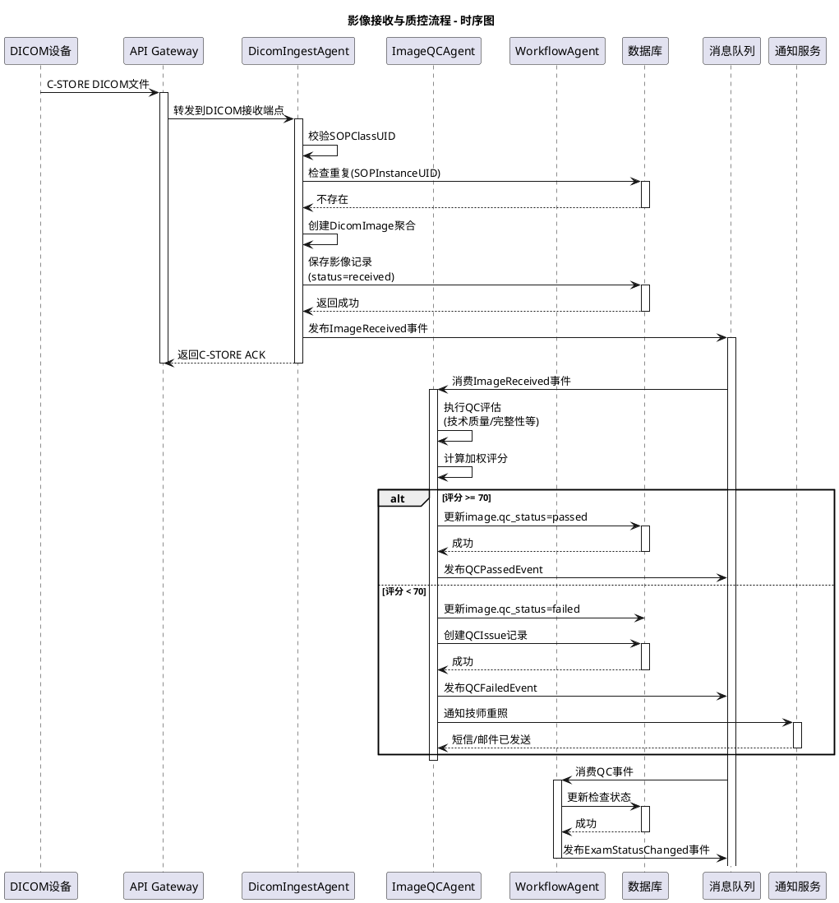
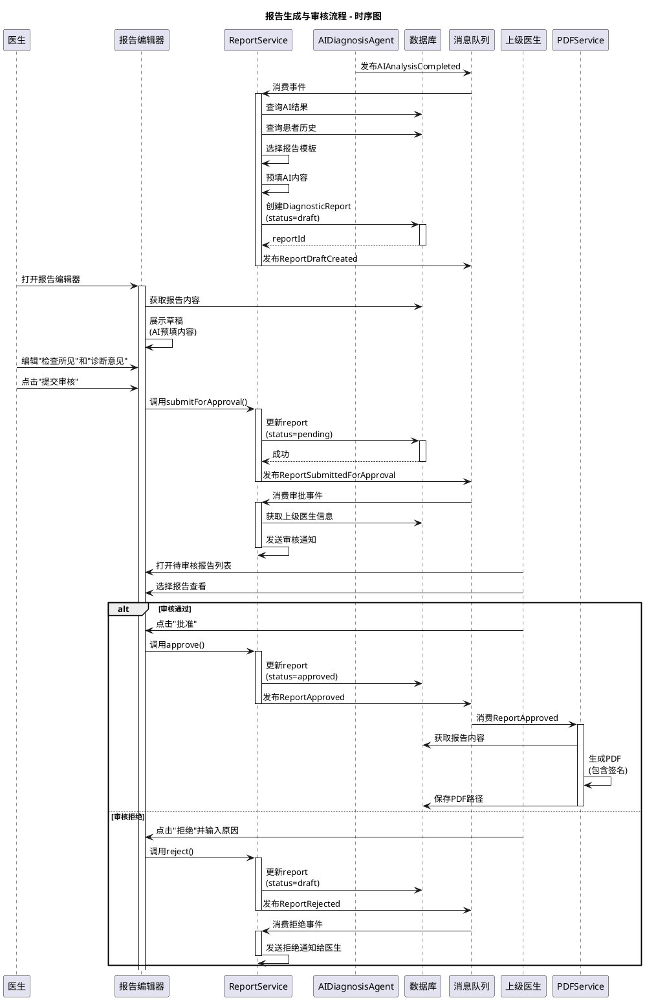
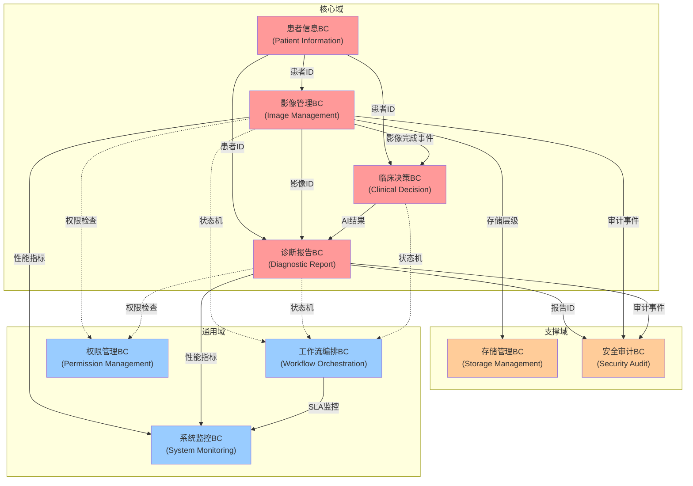
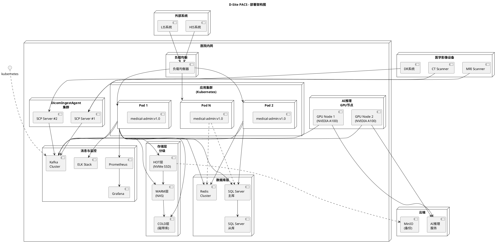
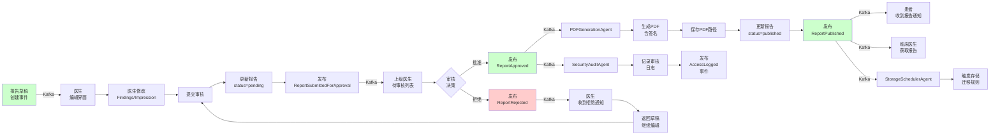
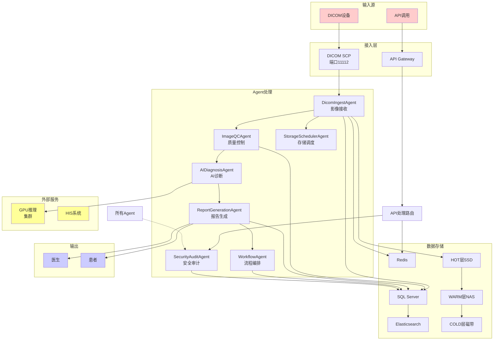

# D-Site PACS 系统架构图集合

> 包含C4架构图、UML类图、时序图、部署架构等完整可视化设计
> 使用PlantUML和Mermaid格式，支持在线渲染和IDE集成

---

## 📋 目录

1. [C4架构模型](#c4架构模型)
2. [UML类图](#uml类图)
3. [UML时序图](#uml时序图)
4. [限界上下文地图](#限界上下文地图)
5. [部署架构](#部署架构)
6. [数据流图](#数据流图)

---

## C4架构模型

### 1. System Context Diagram (系统上下文)

```plantuml
@startuml C4_SystemContext
!include https://raw.githubusercontent.com/plantuml-stdlib/C4-PlantUML/master/C4_Context.puml

title D-Site 云胶片管理系统 - 系统上下文图

Person(doctor, "医生", "放射科医生\n临床医生")
Person(admin, "管理员", "系统管理员\nDBA")
Person(patient, "患者", "医疗患者")
Person(tech, "放射技师", "影像采集技师")

System(pacs, "PACS系统", "医疗影像\n管理系统")

System_Ext(his, "HIS系统", "医院\n信息系统")
System_Ext(lis, "LIS系统", "检验\n信息系统")
System_Ext(dicom_device, "DICOM设备", "CT/MRI/DR\n等医学影像设备")
System_Ext(ai_service, "AI推理服务", "云端AI\n诊断服务")
System_Ext(storage, "对象存储", "MinIO/OSS\n文件存储")

Rel(doctor, pacs, "使用")
Rel(admin, pacs, "管理配置")
Rel(patient, pacs, "查看结果")
Rel(tech, pacs, "采集上传")

Rel(pacs, his, "集成")
Rel(pacs, lis, "集成")
Rel(pacs, dicom_device, "接收影像")
Rel(pacs, ai_service, "调用")
Rel(pacs, storage, "存储读取")

Rel(his, pacs, "申请检查")
Rel(ai_service, pacs, "返回结果")

@enduml
```

---

### 2. Container Diagram (容器级)

```plantuml
@startuml C4_Container
!include https://raw.githubusercontent.com/plantuml-stdlib/C4-PlantUML/master/C4_Container.puml

title D-Site PACS - 容器架构图

Person(user, "用户", "医生/技师/患者")

System_Boundary(browser, "浏览器") {
    Container(web_ui, "Web UI", "Vue 2", "影像查看和报告管理界面")
    Container(dicom_viewer, "DICOM查看器", "OHIF Viewer", "专业影像阅片工具")
}

System_Boundary(hospital_network, "医院内网") {
    System_Boundary(app_layer, "应用层") {
        Container(api_gateway, "API网关", "Spring Cloud Gateway", "请求路由、鉴权、限流")
        Container(medical_admin, "管理服务", "Spring Boot 3.2", "核心业务逻辑")
        Container(auth_service, "认证服务", "JWT Token", "用户认证和授权")
    }

    System_Boundary(data_layer, "数据存储层") {
        Container(sql_server, "关系数据库", "SQL Server 2019", "患者、检查、报告、审计日志")
        Container(redis, "缓存", "Redis", "会话、临时数据、去重缓存")
        Container(es, "搜索引擎", "Elasticsearch", "DICOM元数据全文索引")
        Container(minio, "对象存储", "MinIO", "DICOM文件存储（HOT层）")
        Container(nas, "NAS存储", "NFS", "温层存储（WARM）")
        Container(tape, "磁带库", "Tape Archive", "冷层存储（COLD）")
    }

    System_Boundary(message_layer, "消息与流处理") {
        Container(mq, "消息队列", "Kafka/RabbitMQ", "事件驱动、异步处理")
        Container(agent_framework, "Agent框架", "Temporal.io", "工作流编排")
    }

    System_Boundary(ai_layer, "AI推理层") {
        Container(gpu_cluster, "GPU集群", "NVIDIA GPU", "深度学习推理")
        Container(model_router, "模型路由", "Python FastAPI", "模态识别、模型调度")
    }

    System_Boundary(monitor_layer, "监控运维层") {
        Container(prometheus, "指标采集", "Prometheus", "系统性能指标")
        Container(grafana, "可视化", "Grafana", "仪表板和告警")
        Container(elasticsearch_logs, "日志存储", "ELK Stack", "应用和审计日志")
    }
}

System_Ext(dicom_device, "DICOM设备", "医学影像设备")
System_Ext(his_system, "HIS系统", "医院信息系统")

Rel(user, web_ui, "访问")
Rel(user, dicom_viewer, "查看影像")

Rel(web_ui, api_gateway, "HTTPS")
Rel(dicom_viewer, api_gateway, "HTTP/WebSocket")
Rel(api_gateway, auth_service, "验证Token")
Rel(api_gateway, medical_admin, "转发请求")

Rel(medical_admin, sql_server, "查询/更新")
Rel(medical_admin, redis, "缓存")
Rel(medical_admin, es, "搜索")
Rel(medical_admin, mq, "发布事件")
Rel(medical_admin, minio, "上传/下载")

Rel(mq, agent_framework, "驱动")
Rel(agent_framework, medical_admin, "调用服务")
Rel(agent_framework, gpu_cluster, "调用")

Rel(model_router, gpu_cluster, "调度")
Rel(medical_admin, model_router, "请求")

Rel(medical_admin, prometheus, "上报指标")
Rel(prometheus, grafana, "数据源")
Rel(medical_admin, elasticsearch_logs, "写日志")

Rel(dicom_device, api_gateway, "C-STORE SCP")
Rel(his_system, api_gateway, "HL7/FHIR")

@enduml
```

---

### 3. Component Diagram (组件级)

```plantuml
@startuml C4_Component
!include https://raw.githubusercontent.com/plantuml-stdlib/C4-PlantUML/master/C4_Component.puml

title D-Site PACS - 核心应用组件架构

Container_Boundary(app, "医学影像PACS应用") {

    Component_Boundary(presentation, "表现层") {
        Component(web_controller, "Web Controller", "Spring MVC", "Web接口")
        Component(dicom_controller, "DICOM Controller", "REST", "DICOM API接口")
        Component(auth_controller, "认证Controller", "JWT", "登录/注册/令牌刷新")
    }

    Component_Boundary(application, "应用服务层") {
        Component(patient_service, "患者应用服务", "", "患者管理")
        Component(image_app_service, "影像应用服务", "", "影像接收、存储、分发")
        Component(report_app_service, "报告应用服务", "", "报告创建、审核、发布")
        Component(ai_app_service, "AI应用服务", "", "AI推理调度")
        Component(workflow_app_service, "工作流应用服务", "", "流程编排")
    }

    Component_Boundary(domain, "领域层") {
        Component(patient_aggregate, "Patient聚合根", "DDD", "患者聚合")
        Component(image_aggregate, "DicomImage聚合根", "DDD", "影像聚合")
        Component(report_aggregate, "DiagnosticReport聚合根", "DDD", "报告聚合")
        Component(ai_aggregate, "AIInterpretation聚合根", "DDD", "AI解读聚合")
        Component(workflow_aggregate, "Workflow聚合根", "DDD", "工作流聚合")

        Component(domain_service, "领域服务", "DDD", "QC评估、报告生成、AI融合")
        Component(domain_event, "领域事件", "DDD", "ImageReceived, QCScored等")
    }

    Component_Boundary(repository, "仓储层") {
        Component(patient_repo, "患者仓储", "Spring Data", "患者数据访问")
        Component(image_repo, "影像仓储", "", "影像数据访问")
        Component(report_repo, "报告仓储", "", "报告数据访问")
        Component(ai_repo, "AI仓储", "", "AI结果访问")
    }

    Component_Boundary(infrastructure, "基础设施层") {
        Component(event_publisher, "事件发布器", "Kafka", "领域事件发布")
        Component(storage_service, "存储服务", "MinIO/NAS", "文件存储")
        Component(cache_service, "缓存服务", "Redis", "缓存管理")
        Component(security_service, "安全服务", "Spring Security", "权限和审计")
    }

    Component_Boundary(integration, "集成层") {
        Component(his_adapter, "HIS适配器", "HL7", "HIS集成")
        Component(ai_adapter, "AI服务适配器", "REST API", "AI服务集成")
        Component(dicom_adapter, "DICOM适配器", "dcm4che", "DICOM设备集成")
    }
}

Rel(web_controller, patient_service, "调用")
Rel(web_controller, image_app_service, "调用")
Rel(web_controller, report_app_service, "调用")
Rel(dicom_controller, image_app_service, "调用")
Rel(auth_controller, security_service, "使用")

Rel(patient_service, patient_aggregate, "操作")
Rel(image_app_service, image_aggregate, "操作")
Rel(image_app_service, domain_service, "调用")
Rel(report_app_service, report_aggregate, "操作")
Rel(ai_app_service, ai_aggregate, "操作")
Rel(workflow_app_service, workflow_aggregate, "操作")

Rel(patient_aggregate, patient_repo, "持久化")
Rel(image_aggregate, image_repo, "持久化")
Rel(report_aggregate, report_repo, "持久化")
Rel(ai_aggregate, ai_repo, "持久化")

Rel(patient_service, event_publisher, "发布")
Rel(image_app_service, event_publisher, "发布")
Rel(report_app_service, event_publisher, "发布")

Rel(image_app_service, storage_service, "使用")
Rel(image_app_service, cache_service, "使用")
Rel(patient_service, security_service, "使用")

Rel(image_app_service, dicom_adapter, "使用")
Rel(patient_service, his_adapter, "使用")
Rel(ai_app_service, ai_adapter, "使用")

@enduml
```

---

## UML类图

### 4. 核心聚合根类图

```plantuml
@startuml UML_AggregateRoots
title D-Site PACS - 核心聚合根UML类图

abstract class AggregateRoot {
    - domainEvents: List<DomainEvent>
    # publish(event: DomainEvent): void
    + getDomainEvents(): List<DomainEvent>
    + clearDomainEvents(): void
}

class DicomImage extends AggregateRoot {
    - imageId: ImageId
    - sopInstanceUid: String
    - examId: ExamId
    - seriesId: SeriesId
    - modality: String
    - filePath: FilePath
    - fileSize: FileSize
    - qcScore: QCScore
    - qcStatus: QCStatus
    - storTier: StorageTier
    - isKeyImage: boolean
    - isDesensitized: boolean
    --
    + recordQCScore(score, issues): void
    + migrateStorageTier(tier): void
    + markAsKeyImage(): void
}

class DiagnosticReport extends AggregateRoot {
    - reportId: ReportId
    - examId: ExamId
    - patientId: PatientId
    - status: ReportStatus
    - findings: ReportFindings
    - impression: ReportImpression
    - version: int
    - approvalHistory: ApprovalHistory
    --
    + submitForApproval(supervisor): void
    + approve(approver, comments): void
    + reject(rejector, reason): void
    + publish(): void
    + amendReport(findings, impression): void
}

class AIInterpretation extends AggregateRoot {
    - interpretationId: InterpretationId
    - imageId: ImageId
    - examId: ExamId
    - modality: String
    - modelResults: List<ModelResult>
    - ensembleResult: EnsembleResult
    - confidence: Confidence
    - doctorFeedback: DoctorFeedback
    --
    + recordAnalysisResult(results): void
    + recordDoctorFeedback(doctor, type, comments): void
}

class Patient extends AggregateRoot {
    - patientId: PatientId
    - patientNo: String
    - patientName: String
    - demographics: PatientDemographics
    - medicalHistory: MedicalHistory
    - allergies: List<Allergy>
    --
    + recordAllergy(allergy): void
    + updateMedicalHistory(entry): void
}

class Workflow extends AggregateRoot {
    - workflowId: WorkflowId
    - examId: ExamId
    - currentState: WorkflowState
    - previousState: WorkflowState
    - slaDeadline: Timestamp
    - contextData: Map
    --
    + transitionState(newState, event): void
    + checkSLAViolation(): boolean
    + recordCheckpoint(): void
}

' 值对象
class QCScore {
    - score: BigDecimal
    - evaluatedBy: UserId
    - evaluatedAt: LocalDateTime
    --
    + isPassed(): boolean
}

class StorageTier {
    - tier: Enum
    - lastMigratedAt: LocalDateTime
    - compressionRatio: BigDecimal
    --
    + migrateTo(newTier): StorageTier
}

class Confidence {
    - value: BigDecimal
    - level: ConfidenceLevel
    --
    + isHighConfidence(): boolean
}

class ReportStatus {
    - value: String
}

' 实体
class ApprovalRecord {
    - recordId: ApprovalRecordId
    - action: ApprovalAction
    - actor: DoctorId
    - timestamp: LocalDateTime
}

class QCIssue {
    - issueId: QCIssueId
    - category: String
    - severity: IssueSeverity
    - description: String
}

' 关系
DicomImage *-- "1" FilePath
DicomImage *-- "1" QCScore
DicomImage *-- "1" StorageTier
DicomImage "1" -- "*" QCIssue

DiagnosticReport *-- "1" ReportStatus
DiagnosticReport *-- "1" ApprovalHistory
DiagnosticReport o-- "*" ApprovalRecord

AIInterpretation *-- "1" Confidence
AIInterpretation *-- "*" ModelResult
AIInterpretation *-- "1" EnsembleResult

Patient *-- "*" Allergy
Patient *-- "1" MedicalHistory

@enduml
```



---

## UML时序图

### 5. 影像接收与质控流程时序图



---

### 6. 报告生成与审核流程时序图



---

## 限界上下文地图

### 7. 限界上下文依赖关系图（Mermaid）



---

## 部署架构

### 8. 部署拓扑图



---

## 数据流图

### 9. 影像接收数据流图（Mermaid）

```mermaid
graph LR
    A["DICOM设备"] -->|C-STORE| B["DicomIngestAgent"]
    B -->|验证| C{"SOPInstanceUID\n重复?"}

    C -->|否| D["患者匹配/创建"]
    C -->|是| Z["返回已存在"]

    D --> E["创建DicomImage\n聚合"]
    E --> F["写入cf_image\nstatus=received"]
    F --> G["发布\nImageReceived\n事件"]

    G -->|Kafka| H["ImageQCAgent\n消费"]
    H --> I["执行QC评估"]
    I --> J{"评分\n≥70?"}

    J -->|是| K["发布\nQCPassedEvent"]
    J -->|否| L["发布\nQCFailedEvent"]
    L --> M["通知技师重照"]

    K -->|Kafka| N["AIDiagnosisAgent"]
    N --> O["选择AI模型\n按模态"]
    O --> P["调用GPU\n推理"]
    P --> Q["融合多模型\n结果"]
    Q --> R["发布\nAIAnalysisCompleted"]

    R -->|Kafka| S["ReportGenerationAgent"]
    S --> T["选择报告\n模板"]
    T --> U["AI内容\n预填"]
    U --> V["创建\nDiagnosticReport\n聚合"]
    V --> W["发布\nReportDraftCreated"]

    K -->|Kafka| X["StorageSchedulerAgent"]
    X --> Y["检查分级\n迁移规则"]
    Y --> AB["更新storage_tier\n发布迁移事件"]

    K -->|Kafka| AC["WorkflowAgent"]
    AC --> AD["更新检查\n状态机"]
    AD --> AE["发布\nExamStatusChanged"]

    style A fill:#ffcccc
    style G fill:#ccffcc
    style K fill:#ccffcc
    style R fill:#ccffcc
    style W fill:#ccffcc
```



---

### 10. 报告生成数据流图（Mermaid）



---

### 11. 系统拓扑关键路径图（Mermaid）



---

## 使用说明

### PlantUML 使用

1. **在线渲染**：访问 https://www.plantuml.com/plantuml/uml/
2. **VS Code插件**：安装 "PlantUML" 扩展
3. **本地工具**：
   ```bash
   # 安装
   npm install -g plantuml-cli

   # 生成图像
   plantuml diagram.puml -o output/
   ```

### Mermaid 使用

1. **在线编辑**：https://mermaid.live/
2. **GitHub/GitLab**：直接在markdown中渲染
3. **VS Code**：安装 "Markdown Preview Mermaid Support" 扩展

### 导出为图像

```bash
# PlantUML导出PNG
plantuml -Tpng diagram.puml -o diagram.png

# Mermaid导出PNG（需要mermaid-cli）
mmdc -i diagram.mmd -o diagram.png

# 导出PDF（Mermaid）
mmdc -i diagram.mmd -o diagram.pdf -t dark
```

---

## 架构图用途速查

| 图名 | 用途 | 观众 | 文件格式 |
|-----|------|------|---------|
| System Context | 系统整体视角 | 所有人 | PlantUML |
| Container | 容器部署 | 架构师、运维 | PlantUML |
| Component | 组件内部 | 开发人员 | PlantUML |
| 聚合根类图 | 领域模型 | 开发人员 | PlantUML |
| 时序图 | 业务流程 | 开发、测试 | PlantUML |
| BC地图 | 上下文关系 | 架构师 | Mermaid |
| 部署拓扑 | 物理部署 | 运维、DBA | PlantUML |
| 数据流 | 数据流向 | 所有技术人员 | Mermaid |

---

*最后更新：2026-03-26*
